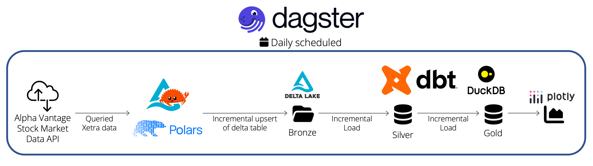

# Local data stack

This project demos how to integrate DuckDB and Delta Lake with dbt, orchestrated by Dagster. All data is stored and processed locally/on-premise. The whole pipeline is partitioned by date range and scheduled to run daily. The stack queries stock exchange (Xetra) data through an API and upserts the result into a Delta table (= bronze layer). The table serves as a source for dbt, which does a layered incremental load into a DuckDB database: first into silver, then into gold. Finally, the gold table is queried with DuckDB to create a line chart in Plotly. Overview:

## How to run

The stack uses [uv](https://docs.astral.sh/uv/getting-started/installation/) to manage its dependencies. Simply run `uv run dg dev` to launch the dagster webserver.
